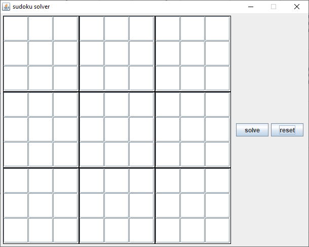
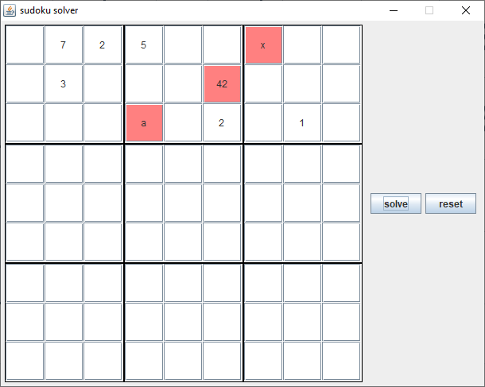
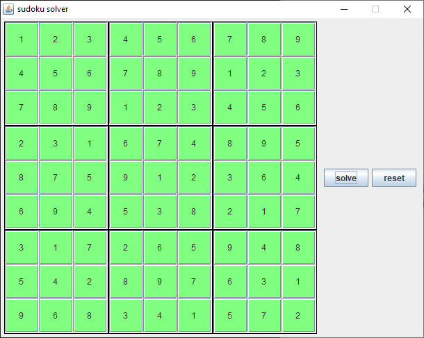

# Sudoku_Solver_GUI

## graphical user interface

## sudoku solver

- uses values from filled in cells to eliminate possible values from empty cells on the same row, column or block
- fill in missing values in a row, column or block by checking in which cells the missing values can be filled in
- when no more values can be filled in using the above methods backtracking is used